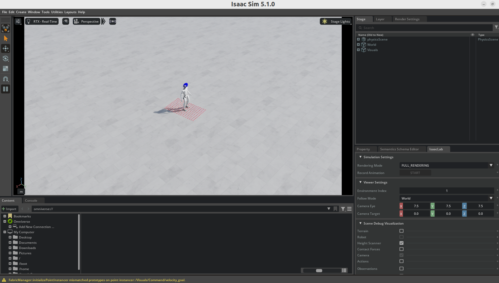

# 1. 项目简介
本工程继承 [unitree_rl_lab](https://github.com/unitreerobotics/unitree_rl_lab)，为 ATEC2026 线上赛搭建初步模拟测试平台。以 Unitree G1 为例，实现对机器人基础状态与传感器数据的回传调用，并在 play 阶段通过接口获取观测数据。

**支持回传的数据**：
['height_scanner', 'camera_image', 'base_lin_vel', 'base_ang_vel', 'projected_gravity', 'velocity_commands', 'joint_pos_rel', 'joint_vel_rel', 'last_action']

**物理意义说明**：
- **height_scanner**：地形高度扫描（射线测距）结果，反映机器人前方/周围地形高度分布。
- **camera_image**：相机图像数据（RGB），反映机器人视野中的视觉信息。
- **base_lin_vel**：机身线速度，表示机器人基座在世界坐标系中的平移速度。
- **base_ang_vel**：机身角速度，表示机器人基座的旋转速度。
- **projected_gravity**：重力方向在机身坐标系中的投影，用于姿态估计与稳定控制。
- **velocity_commands**：当前期望速度指令（线速度与角速度），用于任务跟踪。
- **joint_pos_rel**：关节位置（相对默认/标定位置），反映各关节的姿态偏移。
- **joint_vel_rel**：关节速度（相对/归一化），反映各关节运动速度。
- **last_action**：上一步动作输出（关节目标/控制量），用于策略历史信息。

# 5.2 环境依赖
- **操作系统**：Ubuntu 22.04 / Win11
- **IsaacLab**：https://isaac-sim.github.io/IsaacLab/main/source/setup/installation/index.html.

# 5.3 安装步骤
1. **获取代码**
	- `git clone https://github.com/skywoodsz/ATEC2026_simulation.git`

2. **创建环境（conda / venv）**
	- 使用 IsaacLab 安装时创建的环境：
	  - `conda activate isaaclab`

3. **安装依赖**
	- `pip install -e ./source/unitree_rl_lab/`

4. **模型目录（UNITREE_MODEL_DIR）**
	- 默认自动指向仓库根目录下的 `unitree_model`
	- 如需使用自定义路径，可在运行前导出环境变量：
	```bash
	export UNITREE_MODEL_DIR=/your/path/to/unitree_model
	```

5. **启动方式**
	- `python scripts/rsl_rl/server_play_test.py --task ATEC-Unitree-G1-29dof-Velocity --enable_cameras`
	- 终端会输出数据名称、维度和类型，例如：
    ```
	  - obs keys: ['height_scanner', 'camera_image', 'base_lin_vel', 'base_ang_vel', 'projected_gravity', 'velocity_commands', 'joint_pos_rel', 'joint_vel_rel', 'last_action']
	  - height_scanner: type=<class 'torch.Tensor'>, shape=(1, 187)
	  - camera_image: type=<class 'torch.Tensor'>, shape=(1, 480, 640, 3)
	  - base_lin_vel: type=<class 'torch.Tensor'>, shape=(1, 3)
	  - base_ang_vel: type=<class 'torch.Tensor'>, shape=(1, 3)
	  - projected_gravity: type=<class 'torch.Tensor'>, shape=(1, 3)
	  - velocity_commands: type=<class 'torch.Tensor'>, shape=(1, 3)
	  - joint_pos_rel: type=<class 'torch.Tensor'>, shape=(1, 29)
	  - joint_vel_rel: type=<class 'torch.Tensor'>, shape=(1, 29)
	  - last_action: type=<class 'torch.Tensor'>, shape=(1, 29)
    ```
	- 运行后会启动 Isaac Sim，窗口中会显示机器人场景（如图所示）。
	  

# 5.4 API 使用方法：

**最小示例（server_play_test）**：
- 参考 scripts/rsl_rl/server_play_test.py，在 `on_obs` 中会返回数据字典，后续可通过字典对数据分块或后处理。
